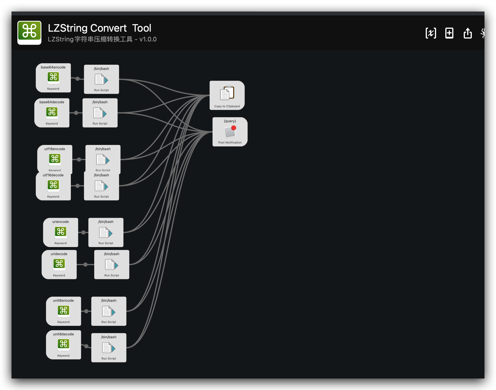

# Mac 命令行

> 练手项目

1. 编译好之后,先赋予执行权限
```bash
chmod a+x LZStringTool

```

2. 调用文档
```bash
======= [ 欢迎使用 LZStringTool ] ==========
 -h 查看文档
 -s 传入需要转换的原字符串
 -c 编码
 -d 解码
 -t 转换类型(base64/utf16/unit8/uri) 默认使用utf16 其中unit8类型解码时传递的是数组 类似这样 '1,2,3,4'这样

 参考以下示例代码

 ./LZStringTool -v    # v1.0.0
 ./LZStringTool -h    # help文档
 ./LZStringTool -e -t 'base64' -s 'hello'
 ./LZStringTool -d -t 'base64' -s 'BYUwNmD2Q==='
 ./LZStringTool -e -t 'utf16' -s 'hello'
 ./LZStringTool -d -t 'utf16' -s 'ˢ䰭䰾搠'
 ./LZStringTool -e -t 'unit8' -s 'hello'
 ./LZStringTool -d -t 'unit8' -s '55,129,176,166,7,96,230,2,224,22,0,32,47,2,10,192,26,4,8,192,158,51,0,206,200,32,3,0,30,1,176,1,193,106,20,12,96,197,1,152,11,228,0,0'
 ./LZStringTool -e -t 'uri' -s 'hello'
 ./LZStringTool -d -t 'uri' -s 'BYUwNmD2Q'
 ./LZStringTool -e -s 'hello'
 ./LZStringTool -d -s 'օ〶惶䀀'
 =============================================

```


3. 利用这个命令行顺手编了个`Alfred workflow`

​	